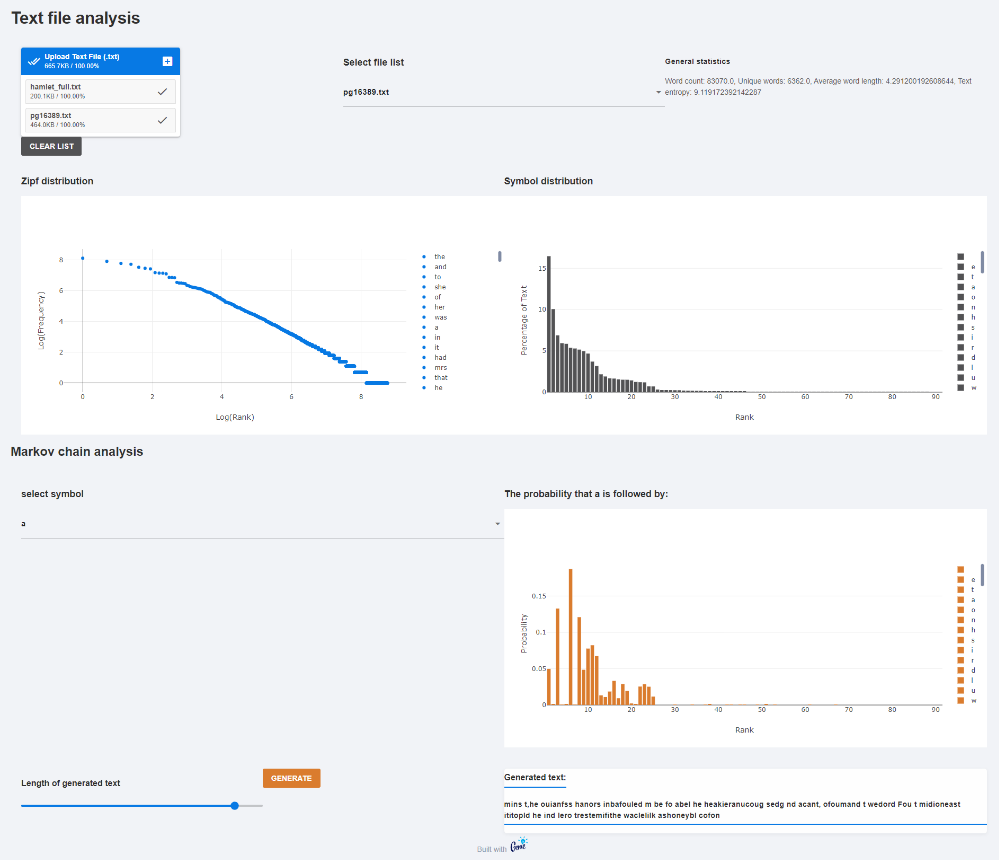

# Zipf-Stats
A genie framework Julia web application that can take a text file as input and generate interactive graphs and various statistics related to the file. <a href="https://zipfstats-zaczipfian.geniecloud.app/" >Try it now</a>.

